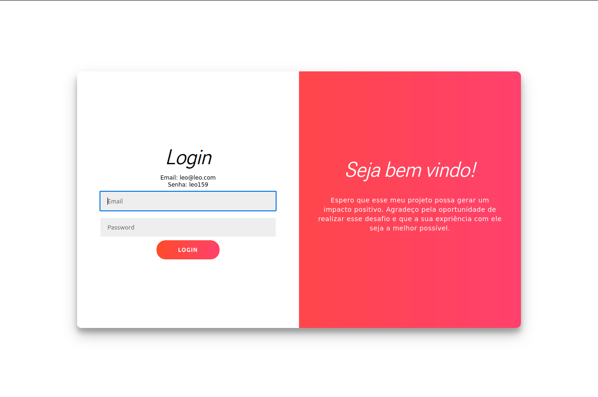

# FrontEndChallenge

<h1 align='center'>
    
    
    <p>Product Shop</p>
</h1>

## 📕 Sobre

**Product Shop** foi a solução feita para um desafio tecnico que visava ocupar o cargo de estágio em desenvolvimento front-end na InChurch. A seguir, vai ser específicado tudo o que foi pedido no desafio:

## Específicações do desafio

Requisitos Básicos: Desenvolver uma página de listagem de produtos, utilizando HTML, CSS e JavaScript. Utilizar a API de loja fake fornecida pelo serviço https://dummyjson.com/. Criar uma página de detalhes para exibir informações completas de cada produto.

Requisitos Opcionais (Diferencial): Se optar por utilizar Angular, será um diferencial. Implementar uma página de login para acesso à aplicação. Adicionar funcionalidades de CRUD (Create, Read, Update, Delete) para os produtos, incluindo listagem, detalhe, exclusão e edição.

## 🛠️ Recursos Utilizados para desenvolver a aplicação Full Stack

- Angular version 17.3.0
- Angular icons
- axios

## 👨🏾‍💻 Como rodar o projeto na sua máquina

```bash
# Com a sua chave SSH ativada e pronta para uso, em sua máquina selecione a pasta onde você quer colocar esse projeto, abra o terminal nela e depois copie e cole o seguinte comando no seu terminal:

$ git clone git@github.com:leofrs/desafio-frontEnd.git
```

obs: Caso não queira realizar o clone do projeto, basta realizar download
1 - Vá na opção `<Code>`
2 - Após clicar, vai aparecer a opção `Download ZIP`
3 - Ele vai vir compactado em um arquivo `.ZIP`. Faça a extração e siga os próximos passos abaixo.

Após ter feito o clone ou download, instale as dependências necessárias para rodar o projeto. Com a pasta do projeto aberta no terminal, execute os seguintes comandos um por vêz

```bash
# Se você utiliza npm, abra a pasta client no terminal e em outro terminal abra a pasta server e insira o seguinte comendo em cada terminal
$ npm i
```

```bash
# Se você utiliza yarn, abra a pasta client no terminal e em outro terminal abra a pasta server e insira o seguinte comendo em cada terminal
$ yarn i
```

Agora, execute o comando abaixo em seu terminal para rodar o projeto em seu `http://localhost:4200/`

```bash
# Para rodar o projeto em sua máquina, utilize o seguinte comando
$ ng serve
```

```bash
# Para conseguir acessar a página insira o email e senha
email1: leo@leo.com
senha1: leo159

email2: leo2@leo2.com
senha2: leo2159

obs: O email1 e senha1 também vão estar disponíveis na tela de login para uma melhor visualização.
```
